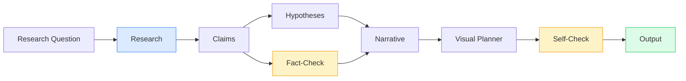

# SCAD — Stellator Cognitive Architecture Driver

A modular pipeline for creating documentary film concepts using AI.  
The system chains research, claims extraction, hypothesis evaluation, fact-checking, narrative writing, and visual planning — all with schema validation, resumable checkpoints, and full source-to-shot traceability.

## Pipeline Overview



Each stage is **resumable**: artifacts are saved to `data/projects/<name>/memory/` and skipped on re-run unless `--force` is passed.  
Fact-Check and Self-Check are **deterministic engines** (rules, not LLM) — they verify structure and consistency of the output without calling an API.

## Quick Start

```bash
npm install
npm run build
npm run lint
npm test
```

Generate a documentary concept offline (no API key required):

```bash
LLM_PROVIDER=mock npx scad documentary humanity-species
```

The mock provider returns deterministic JSON responses suitable for demos and testing.

## Commands

| Command                                      | Description                                     |
| -------------------------------------------- | ----------------------------------------------- |
| `npx scad documentary <title>`               | Run the full pipeline for a documentary concept |
| `npx scad documentary <title> --force`       | Re-run all stages from scratch                  |
| `npx scad documentary <title> --interactive` | Halt at checkpoints for human approval          |
| `npx scad help`                              | Show help text                                  |

### Human Approval

SCAD is not fully autonomous by default. Pass `--interactive` (or `-i`) to review each
checkpoint before it is locked in:

- **RESEARCH REVIEW** → **HYPOTHESIS REVIEW** → **NARRATIVE REVIEW** → **FINAL FACT CHECK**

At every checkpoint you can: `(a)pprove`, `(r)eject`, `(m)odify` (opens the artifact in
`$EDITOR`), or `(g)enerate` the stage again. Approved states are recorded in
`data/projects/<name>/memory/approved.json`. Without the flag, the pipeline auto-approves
every stage (suitable for automation and CI).

Set `SCAD_DATA_DIR` to change the output root (default: `data/projects`).

## LLM Providers

Configure via `.env`:

| Provider     | Setting                 | Notes                                                           |
| ------------ | ----------------------- | --------------------------------------------------------------- |
| **OpenCode** | `LLM_PROVIDER=opencode` | Default. Uses `OPENCODE_MODEL` (default: `opencode/big-pickle`) |
| **Ollama**   | `LLM_PROVIDER=ollama`   | Requires local Ollama server. Set `OLLAMA_MODEL`                |
| **Mock**     | `LLM_PROVIDER=mock`     | Offline. Returns canned JSON by stage. No API key needed        |

## Project Structure

```
src/
  core/          # Domain types, Zod schemas, pipeline engine, memory store
  agents/        # 5 LLM agents + 2 deterministic engines
  providers/     # LLM + search provider abstractions
  storage/       # Artifact export (project-store)
  cli/           # CLI entry point (bin.ts → cli.ts → dispatch.ts)
prompts/         # System prompt files per stage (loaded at runtime)
tests/           # Vitest unit + integration tests
examples/        # Generated documentary concept projects (mock provider)
```

### Agent Types

| Agent             | Stage        | Type          | Description                                                        |
| ----------------- | ------------ | ------------- | ------------------------------------------------------------------ |
| `ResearchAgent`   | `research`   | LLM           | Gathers sources for the topic                                      |
| `ClaimsAgent`     | `claims`     | LLM           | Extracts factual claims with knowledge-level classification        |
| `HypothesisAgent` | `hypotheses` | LLM           | Generates testable hypotheses grounded in claims                   |
| `FactCheckEngine` | `factCheck`  | Deterministic | Verifies claims against research sources                           |
| `NarrativeAgent`  | `narrative`  | LLM           | Writes a narrative structure with knowledge-level tagged sentences |
| `VisualAgent`     | `visual`     | LLM           | Converts narrative into visual shots                               |
| `SelfCheckEngine` | `selfCheck`  | Deterministic | Validates structural consistency of all outputs                    |

## Testing

```bash
npm test          # 43 tests — schemas, pipeline, engines, integration
npm run check     # TypeCheck (tsc --noEmit)
npm run lint      # ESLint (zero warnings)
```

All tests run **offline** with `MockLLMProvider` — no API key required.

## Traceability

Every shot in the output traces back through:

```
SHOT → SNT (narrative sentence) → CLM (claim) → SRC (source)
```

The full traceability report is generated by `buildTraceabilityReport()` and included in the pipeline output.

## License

MIT
