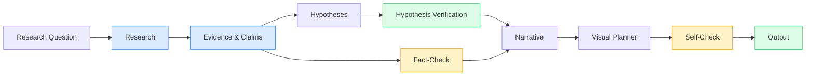
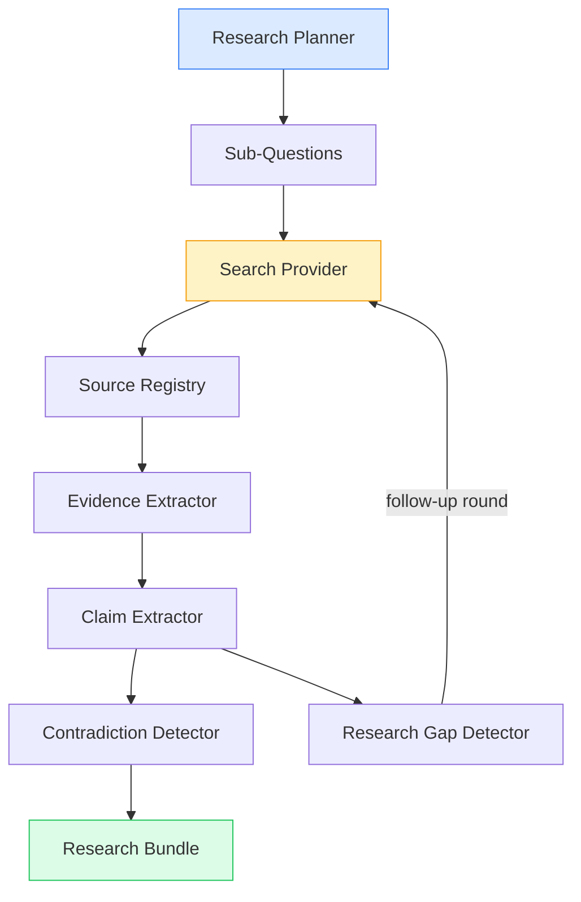

# SCAD — Stellator Cognitive Architecture Driver

A modular pipeline for creating documentary film concepts using AI.  
The system chains research, evidence extraction, claims, hypothesis verification, fact-checking, narrative writing, and visual planning — all with schema validation, resumable checkpoints, and full source-to-shot traceability.

## Pipeline Overview



### Evidence & Research Engine

The research stage is an engine, not a single prompt. It churns the raw question
through a closed loop of sub-stages:



Each sub-stage is backed by an LLM prompt with a **deterministic fallback**: if the model
output fails validation, the engine degrades gracefully to heuristic logic instead of
blocking the pipeline. Evidence, claims, contradictions, and research gaps are always
reproducible, and claims link back through evidence to specific sources.

Each pipeline stage is **resumable**: artifacts are saved to `data/projects/<name>/memory/`
and skipped on re-run unless `--force` is passed. Fact-Check, Self-Check, hypothesis
verification, and the research fallbacks are **deterministic engines** (rules, not LLM) —
they verify structure and consistency of the output without calling an API.

## Quick Start

```bash
npm install
npm run build
npm run lint
npm test
```

Generate a documentary concept offline (no API key required):

```bash
LLM_PROVIDER=mock npx scad documentary humanity-species
```

The mock provider returns deterministic JSON responses suitable for demos and testing,
and the built-in mock search provider makes the whole chain run offline.

## Commands

| Command                                      | Description                                     |
| -------------------------------------------- | ----------------------------------------------- |
| `npx scad documentary <title>`               | Run the full pipeline for a documentary concept |
| `npx scad documentary <title> --force`       | Re-run all stages from scratch                  |
| `npx scad documentary <title> --interactive` | Halt at checkpoints for human approval          |
| `npx scad sources <project>`                 | Inspect research sources                        |
| `npx scad evidence <project>`                | Inspect extracted evidence                      |
| `npx scad contradictions <project>`          | Inspect detected contradictions                 |
| `npx scad gaps <project>`                    | Inspect research gaps and priorities            |
| `npx scad trace <project>`                   | Show shot → claim → evidence → source tracing   |
| `npx scad help`                              | Show help text                                  |

### Human Approval

SCAD is not fully autonomous by default. Pass `--interactive` (or `-i`) to review each
checkpoint before it is locked in:

- **RESEARCH REVIEW** → **HYPOTHESIS REVIEW** → **NARRATIVE REVIEW** → **FINAL FACT CHECK**

At every checkpoint you can: `(a)pprove`, `(r)eject`, `(m)odify` (opens the artifact in
`$EDITOR`), or `(g)enerate` the stage again. Approved states are recorded in
`data/projects/<name>/memory/approved.json`. Without the flag, the pipeline auto-approves
every stage (suitable for automation and CI).

Set `SCAD_DATA_DIR` to change the output root (default: `data/projects`).

## Configuration

Configure via `.env` (see `.env.example`):

| Setting             | Values                                  | Notes                                  |
| ------------------- | --------------------------------------- | -------------------------------------- |
| `LLM_PROVIDER`      | `opencode` \| `ollama` \| `mock`        | LLM backend; `mock` is fully offline   |
| `OPENCODE_MODEL`    | e.g. `opencode/big-pickle`              | Used by the OpenCode provider          |
| `OLLAMA_BASE_URL`   | `http://127.0.0.1:11434`                | Local Ollama endpoint                  |
| `OLLAMA_MODEL`      | e.g. `llama3`                           | Ollama model name                      |
| `SEARCH_PROVIDER`   | `mock` (default) \| `brave` \| `google` | Search backend for the research engine |
| `SCAD_SEARCH_CACHE` | `1`                                     | Cache search results per project run   |
| `SCAD_DATA_DIR`     | `data/projects`                         | Where documentary projects are stored  |

## Project Structure

```
src/
  core/          # Domain types, Zod schemas, pipeline engine, memory store
  agents/        # LLM agents + deterministic engines (research, hypothesis, ...)
  providers/     # LLM + search provider abstractions
  storage/       # Artifact export (project-store)
  cli/           # CLI entry point (bin.ts → cli.ts → dispatch.ts)
prompts/         # System prompt files per stage (loaded at runtime)
tests/           # Vitest unit + integration tests
examples/        # Generated documentary concept projects (mock provider)
```

### Agent Types

| Component          | Stage        | Type          | Description                                                        |
| ------------------ | ------------ | ------------- | ------------------------------------------------------------------ |
| `ResearchEngine`   | `research`   | LLM + rules   | Plan → search → evidence → claims → contradictions → gaps loop     |
| `ClaimsAgent`      | `claims`     | LLM           | Legacy claim extraction (used only when research has no claims)    |
| `HypothesisAgent`  | `hypotheses` | LLM           | Generates testable hypotheses grounded in evidence                 |
| `verifyHypotheses` | `hypotheses` | Deterministic | Verifies hypotheses against evidence, gaps, and contradictions     |
| `FactCheckEngine`  | `factCheck`  | Deterministic | Verifies claims against research sources                           |
| `NarrativeAgent`   | `narrative`  | LLM           | Writes a narrative structure with knowledge-level tagged sentences |
| `VisualAgent`      | `visual`     | LLM           | Converts narrative into visual shots                               |
| `SelfCheckEngine`  | `selfCheck`  | Deterministic | Validates structural consistency of all outputs                    |

## Testing

```bash
npm test          # 71 tests — schemas, engines, traceability, integration
npm run check     # TypeCheck (tsc --noEmit)
npm run lint      # ESLint (zero warnings)
```

All tests run **offline** with `MockLLMProvider` — no API key required.

## Traceability

Every shot in the output traces back through the evidence chain:

```
SHOT → SNT (narrative sentence) → CLM (claim) → EVID (evidence) → SRC (source)
```

`TraceService` builds the full report from the research bundle, and
`buildTraceabilityReport()` covers the legacy pipeline; both are included in the output
(`traceability.json`).

## License

MIT
