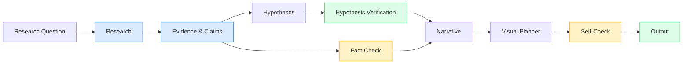
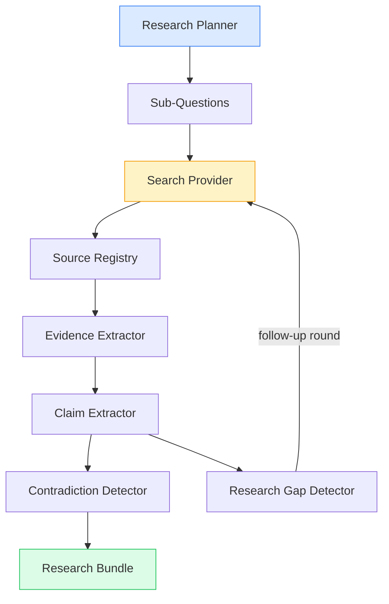
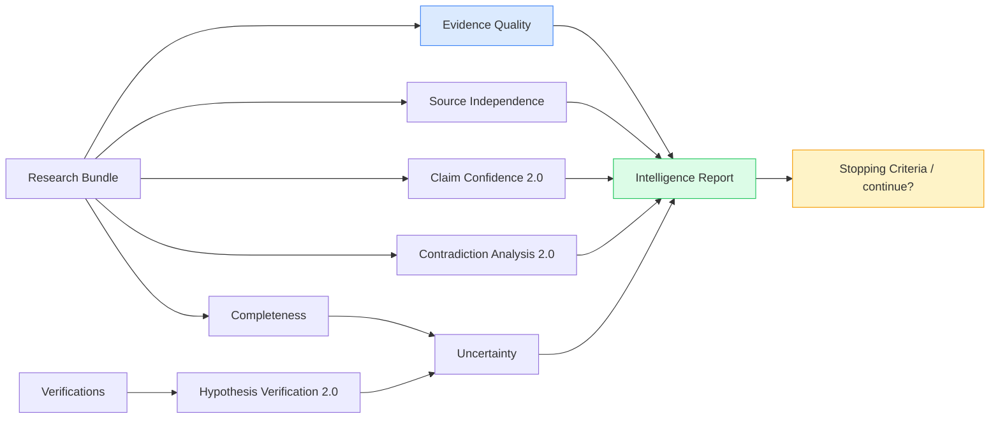

# SCAD — Stellator Cognitive Architecture Driver

A modular pipeline for creating documentary film concepts using AI.  
The system chains research, evidence extraction, claims, hypothesis verification, fact-checking, narrative writing, and visual planning — all with schema validation, resumable checkpoints, and full source-to-shot traceability.

## Pipeline Overview



### Evidence & Research Engine

The research stage is an engine, not a single prompt. It churns the raw question
through a closed loop of sub-stages:



Each sub-stage is backed by an LLM prompt with a **deterministic fallback**: if the model
output fails validation, the engine degrades gracefully to heuristic logic instead of
blocking the pipeline. Evidence, claims, contradictions, and research gaps are always
reproducible, and claims link back through evidence to specific sources.

Each pipeline stage is **resumable**: artifacts are saved to `data/projects/<name>/memory/`
and skipped on re-run unless `--force` is passed. Fact-Check, Self-Check, hypothesis
verification, and the research fallbacks are **deterministic engines** (rules, not LLM) —
they verify structure and consistency of the output without calling an API.

### Research Intelligence (v0.4)

On top of the research bundle, SCAD evaluates the _quality of its own research_ with a fully
deterministic, explainable scoring layer — no LLM is involved in any score. The
`ResearchIntelligenceEngine` produces a single `intelligence.json` report:



- **Evidence Quality** — reliability, strength, directness, specificity, freshness,
  each scored and averaged into an explainable overall.
- **Source Independence** — pairwise structural relationships (identical URL → repost,
  shared publisher → derived, shared domain → reference, distinct outlets → independent,
  otherwise `UNKNOWN`). Independence is never silently assumed: a lone source can never
  count as independent, and a pair with only `UNKNOWN` relationships yields no verdict.
- **Claim Confidence 2.0** — support vs contradiction strength, agreement, independence
  ratio, source reliability and completeness impact, collapsed into one of
  `STRONGLY_SUPPORTED → SUPPORTED → PARTIALLY_SUPPORTED → INCONCLUSIVE → CONTESTED →
CONTRADICTED → INSUFFICIENT_EVIDENCE`.
- **Contradiction Analysis 2.0** — each conflict is resolved into a likely context
  (time/population/definition/scope/methodology/measurement) before it can be branded a
  genuine contradiction.
- **Completeness & stopping** — nine weighted dimensions, critical gaps, unresolved
  contradictions, and a deterministic "should we keep researching?" decision that always
  respects hard resource limits. Substantive uncertainty (`CONFLICTING_EVIDENCE`,
  `LOW_QUALITY_EVIDENCE`) also feeds the decision, so research does not "stop green" while
  the report itself flags serious uncertainty.
- **Explicit Uncertainty** — claims and hypotheses carry typed uncertainty
  (`UNCERTAIN`, `INSUFFICIENT_EVIDENCE`, `CONFLICTING_EVIDENCE`, `LOW_QUALITY_EVIDENCE`)
  instead of plain low confidence.
- **Hypothesis Verification 2.0** — the base verdict is enriched with evidence quality,
  independent source counts, the contradiction records that touch the hypothesis's
  evidence, alternative explanations and hypothesis-level uncertainty.

> **Caveat.** Every score above is a _weighted heuristic for review_, not an objective
> measure of truth. SCAD never asserts that a source is truly independent or that research
> is complete — it reports what the structural signals suggest and always keeps `UNKNOWN`
> as a legal answer.

## Quick Start

```bash
npm install
npm run build
npm run lint
npm test
```

Generate a documentary concept offline (no API key required):

```bash
LLM_PROVIDER=mock npx scad documentary humanity-species
```

The mock provider returns deterministic JSON responses suitable for demos and testing,
and the built-in mock search provider makes the whole chain run offline.

## Commands

| Command                                                 | Description                                                          |
| ------------------------------------------------------- | -------------------------------------------------------------------- |
| `npx scad documentary <title>`                          | Run the full pipeline for a documentary concept                      |
| `npx scad documentary <title> --force`                  | Re-run all stages from scratch                                       |
| `npx scad documentary <title> --interactive`            | Halt at checkpoints for human approval                               |
| `npx scad documentary <title> --provider <mock\|brave>` | Override the search provider for this run                            |
| `npx scad sources <project>`                            | Inspect research sources                                             |
| `npx scad evidence <project>`                           | Inspect extracted evidence                                           |
| `npx scad contradictions <project>`                     | Inspect detected contradictions                                      |
| `npx scad gaps <project>`                               | Inspect research gaps and priorities                                 |
| `npx scad trace <project>`                              | Show shot → claim → evidence → source tracing                        |
| `npx scad intelligence <project>`                       | Show the v0.4 intelligence report summary                            |
| `npx scad intelligence <project> <view>`                | One view: quality\|completeness\|verify\|contradictions\|uncertainty |
| `npx scad help`                                         | Show help text                                                       |

### Human Approval

SCAD is not fully autonomous by default. Pass `--interactive` (or `-i`) to review each
checkpoint before it is locked in:

- **RESEARCH REVIEW** → **HYPOTHESIS REVIEW** → **NARRATIVE REVIEW** → **FINAL FACT CHECK**

At every checkpoint you can: `(a)pprove`, `(r)eject`, `(m)odify` (opens the artifact in
`$EDITOR`), or `(g)enerate` the stage again. Approved states are recorded in
`data/projects/<name>/memory/approved.json`. Without the flag, the pipeline auto-approves
every stage (suitable for automation and CI).

Set `SCAD_DATA_DIR` to change the output root (default: `data/projects`).

## Configuration

Configure via `.env` (see `.env.example`):

| Setting                        | Values                                                      | Notes                                                     |
| ------------------------------ | ----------------------------------------------------------- | --------------------------------------------------------- |
| `LLM_PROVIDER`                 | `opencode` \| `ollama` \| `mock` \| `openai` \| `anthropic` | LLM backend; `mock` is fully offline                      |
| `OPENAI_API_KEY`               |                                                             | Required for `LLM_PROVIDER=openai`                        |
| `OPENAI_MODEL`                 | e.g. `gpt-4o`                                               | OpenAI model (used unless overridden)                     |
| `ANTHROPIC_API_KEY`            |                                                             | Required for `LLM_PROVIDER=anthropic`                     |
| `ANTHROPIC_MODEL`              | e.g. `claude-sonnet-4-20250514`                             | Anthropic model (used unless overridden)                  |
| `SEARCH_PROVIDER`              | `mock` (default) \| `brave`                                 | Search backend for the research engine                    |
| `BRAVE_SEARCH_API_KEY`         |                                                             | Required for `SEARCH_PROVIDER=brave`                      |
| `CONTENT_PROVIDER`             | `noop` (default) \| `mock` \| `http`                        | Full-page content fetcher for evidence                    |
| `RESEARCH_MAX_QUERIES`         | `10`                                                        | Max sub-questions per research run                        |
| `RESEARCH_MAX_RESULTS`         | `8`                                                         | Max search results per query                              |
| `RESEARCH_MAX_FOLLOWUP_ROUNDS` | `1`                                                         | How often gaps trigger follow-up research                 |
| `RESEARCH_MAX_SOURCES`         | `40`                                                        | Global cap on collected sources                           |
| `RESEARCH_MAX_CONTENT`         | `8000`                                                      | Per-source content length limit (chars)                   |
| `SCAD_REFERENCE_DATE`          | ISO date, e.g. `2026-01-15`                                 | Roots freshness + `generatedAt` for reproducible scores   |
| `CACHE_ENABLED`                | `1`                                                         | `0` disables the JSON file cache entirely                 |
| `CACHE_TTL`                    | `86400`                                                     | Cache TTL in seconds                                      |
| `SCAD_CACHE_DIR`               | `data/cache`                                                | Where cache JSON files are stored (`data/` is gitignored) |
| `SCAD_DATA_DIR`                | `data/projects`                                             | Where documentary projects are stored                     |

### Providers & caching

- **LLM** — `openai` and `anthropic` call the real APIs with retry/timeout handling;
  `opencode` and `ollama` run local or remote models; `mock` returns deterministic JSON.
- **Search** — `brave` calls Brave Search (1000 free requests/month); `mock` is an offline
  fixture provider used by tests and demos.
- **Content** — real research is enriched with full page text: `http` fetches and extracts
  the page body (size-capped), `mock` serves fixture text, `noop` relies on snippets.
- **Cache** — search and content results are persisted as JSON under `SCAD_CACHE_DIR`
  keyed by provider + canonical URL, honoring `CACHE_ENABLED`/`CACHE_TTL`.

All real providers share `fetchWithRetry` (`src/providers/http.ts`): per-attempt timeouts,
exponential backoff, `Retry-After` handling, and automatic retry on transient failures
(408/429/5xx, timeouts, network errors).

## Project Structure

```
src/
  core/          # Domain types, Zod schemas, pipeline engine, memory store
  agents/        # LLM agents + deterministic engines (research, hypothesis, ...)
  providers/     # LLM + search + content + cache provider abstractions
  storage/       # Artifact export (project-store)
  cli/           # CLI entry point (bin.ts → cli.ts → dispatch.ts)
prompts/         # System prompt files per stage (loaded at runtime)
tests/           # Vitest unit + integration + E2E tests (offline)
examples/        # Generated documentary concept projects (mock provider)
```

Providers are injected into the research engine through small single-responsibility
interfaces: `SearchProvider`, `ContentProvider`, and `LLMProvider`. Cached variants wrap
any implementation without changing its contract, so the offline path and the real-API
path share one codebase.

### Agent Types

| Component                    | Stage        | Type          | Description                                                        |
| ---------------------------- | ------------ | ------------- | ------------------------------------------------------------------ |
| `ResearchEngine`             | `research`   | LLM + rules   | Plan → search → evidence → claims → contradictions → gaps loop     |
| `ClaimsAgent`                | `claims`     | LLM           | Legacy claim extraction (used only when research has no claims)    |
| `HypothesisAgent`            | `hypotheses` | LLM           | Generates testable hypotheses grounded in evidence                 |
| `verifyHypotheses`           | `hypotheses` | Deterministic | Verifies hypotheses against evidence, gaps, and contradictions     |
| `ResearchIntelligenceEngine` | `research`   | Deterministic | v0.4: quality/independence/confidence/completeness/uncertainty     |
| `FactCheckEngine`            | `factCheck`  | Deterministic | Verifies claims against research sources                           |
| `NarrativeAgent`             | `narrative`  | LLM           | Writes a narrative structure with knowledge-level tagged sentences |
| `VisualAgent`                | `visual`     | LLM           | Converts narrative into visual shots                               |
| `SelfCheckEngine`            | `selfCheck`  | Deterministic | Validates structural consistency of all outputs                    |

## Testing

```bash
npm test          # unit + integration + E2E tests (offline, deterministic)
npm run check     # TypeCheck (tsc --noEmit)
npm run lint      # ESLint (zero warnings)
npm run format:check # Prettier
```

All tests run **offline** with `MockLLMProvider` / `MockSearchProvider` — no API key
required. Real-provider behavior (Brave, OpenAI, Anthropic, HTTP content) is exercised
against mocked `fetch` calls.

## Traceability

Every shot in the output traces back through the evidence chain:

```
SHOT → SNT (narrative sentence) → CLM (claim) → EVID (evidence) → SRC (source)
```

`TraceService` builds the full report from the research bundle, and
`buildTraceabilityReport()` covers the legacy pipeline; both are included in the output
(`traceability.json`). When an intelligence report exists, each trace entry is enriched
with the claim's v0.4 assessment, evidence quality, contradiction analyses and explicit
uncertainties.

## Domain Model

Core entities produced and consumed by the pipeline (all validated with Zod):

| Entity                       | Stage          | Description                                                     |
| ---------------------------- | -------------- | --------------------------------------------------------------- |
| `Source`                     | `research`     | A normalized, deduplicated reference with reliability/relevance |
| `SearchQuery`                | `research`     | A concrete query bound to a sub-question                        |
| `Evidence`                   | `research`     | A claim-level finding tied to exactly one source                |
| `Claim`                      | `research`     | A conclusion backed by linked evidence ids and sources          |
| `Contradiction`              | `research`     | Classified conflicts (population/period/definition/methodology) |
| `ResearchGap`                | `research`     | Uncovered sub-questions, weak evidence or open verification     |
| `ResearchBundle`             | `research`     | The full deterministic research output of one run               |
| `EvidenceQuality`            | `intelligence` | Five-dimension quality portrait of every evidence item          |
| `SourceIndependenceResult`   | `intelligence` | Pairwise source relationships and independence profile          |
| `ClaimConfidenceAssessment`  | `intelligence` | Claim Confidence 2.0 with reasons                               |
| `ContradictionAnalysis`      | `intelligence` | Conflict resolved into a likely context                         |
| `ResearchCompleteness`       | `intelligence` | Nine weighted dimensions + stopping criteria                    |
| `Uncertainty`                | `intelligence` | Typed uncertainty per claim/hypothesis/research                 |
| `VerificationResult`         | `intelligence` | Hypothesis Verification 2.0 enrichment                          |
| `ResearchIntelligenceReport` | `intelligence` | The full v0.4 report (`intelligence.json`)                      |
| `Hypothesis`                 | `hypotheses`   | A testable assumption grounded in evidence                      |
| `FactCheckAssessment`        | `factCheck`    | A claim checked against the research artifact                   |
| `Narrative`                  | `narrative`    | Sections of knowledge-tagged sentences                          |
| `Shot`                       | `visual`       | A timed visual beat linked to narrative sentences               |
| `SelfCheck`                  | `selfCheck`    | Structural validation report over all artifacts                 |
| `TraceabilityReport`         | `traceability` | Shot → sentence → claim → evidence → source chain               |

**Research loop.** The research stage runs `question → plan → search → sources → evidence →
claims → contradictions → gaps → follow-up research → updated claims`, then ships the
`ResearchBundle` to hypotheses and fact-check. Because the whole chain degrades to
deterministic fallbacks, the loop runs identically offline and online.

## Roadmap

- **v0.1 — Core pipeline prototype (done).** The 7-stage pipeline with mock providers,
  resumable stages, human-approval checkpoints, and full traceability; first documentary
  concept generated offline.
- **v0.2 — Evidence & Research Engine (done).** Research became an engine: plan → search →
  sources → evidence → claims → contradictions → gaps → follow-up rounds, deterministic
  fallbacks everywhere, hypotheses verified against the evidence chain, and a working
  `ResearchBundle`. Ship: traceability report for every shot.
- **v0.3 — Real research providers (done).** Brave Search binding, OpenAI + Anthropic LLM
  bindings, content-extraction abstraction (`http`/`mock`/`noop`), JSON file caching with
  TTL, and retry/timeout/backoff transport shared by all real providers. Offline mode
  (`mock` everywhere) still requires no API keys.
- **v0.4 — Research Intelligence & Verification (done).** SCAD now evaluates its own
  research deterministically: evidence quality, source independence, Claim Confidence 2.0,
  contradiction analysis, research completeness with stopping criteria, explicit
  uncertainty, and Hypothesis Verification 2.0 — all explainable and offline. New
  `scad intelligence <project>` command and `intelligence.json` artifact. `UNKNOWN` stays a
  legal answer everywhere; scores are heuristics for review, never truth claims.
- **v0.4.1 — Epistemic integrity fixes (done).** A single source can never be declared
  independent (`independentCount` is now 0 for one-source claims and for `UNKNOWN` pairs).
  Verification enrichment surfaces the contradiction records over its touched claims
  instead of comparing misaligned id namespaces. The stopping criteria consume explicit
  `CONFLICTING_EVIDENCE`/`LOW_QUALITY_EVIDENCE` uncertainty, so research no longer stops
  while the report itself flags serious uncertainty. Freshness is reproducible via an
  explicit `referenceDate`/`SCAD_REFERENCE_DATE`, and `followUpRoundsUsed` is tracked —
  not inferred — while the bogus `maxIterations` mapping was dropped.
- **v0.5 — Validation & scale (next).** Vector storage behind the `MemoryStore` seam,
  richer approve/reject/modify UI, more search providers, and staged documentary extraction
  (longer, source-driven outputs).

## License

MIT
